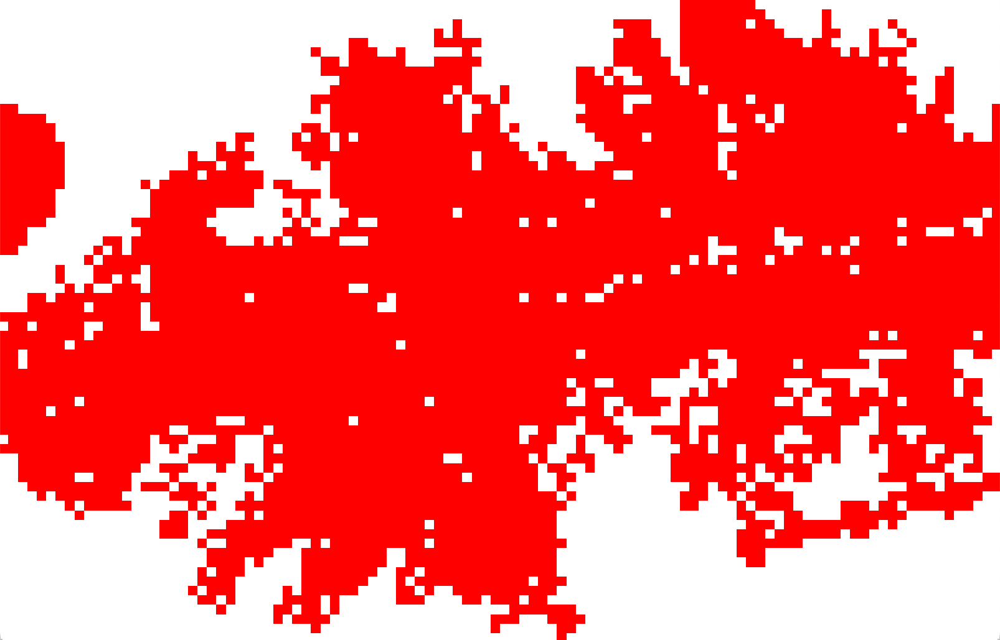
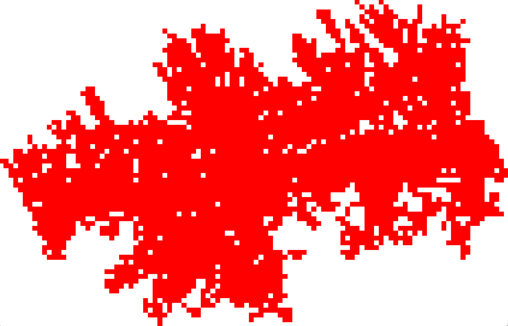

# ring-of-fire  


A parallelized genetic program for evolving rules that describe a cellular automaton-based wildfire simulation using Clojure and based on the [propel framework](https://github.com/lspector/propel) designed by [Lee Spector](https://github.com/lspector). 

Created by [Isaac Caruso](https://github.com/icaruso21), [Oliver Baldwin Edwards](https://github.com/Oliver-BE), and [Martin Glusker](https://github.com/mglusker). 
Special thanks to Lee Spector for his invaluable assistance and advice. 
Project inspired by and data sourced from [Cell2Fire](https://github.com/cell2fire/Cell2Fire).

## Usage

**To run:**
 * Clone repository
 * Navigate to  `src/ring-of-fire` and run command: `lein run`
    * Note that `lein run` will run the genetic program with the following default arguments:

    ```clojure
    {:instructions            fire-instructions
     :error-function          fire-error-function
     :max-generations         5000
     :population-size         10
     :max-initial-plushy-size 40
     :parent-selection        :lexicase
     :tournament-size         5
     :fire-selection          2
     :time-step               3
     :step-limit              100}
    ```

 * To run the genetic program with user-defined arguments, add key-value pairs as arguments after `lein run` 
 * Example usage: `lein run :population-size 20 :parent-selection :tournament :max-generations 1000` 
    
## Data

We sourced our data from [Cell2Fire](https://github.com/cell2fire/Cell2Fire). 
The data was used to both specify the parameters for instructions in our genetic program (such as the weather data) and to 
calculate the error in our results (by using the actual final fire scar).
Ten fires were provided, each with data of the following type:

| Data File                | Description   |
| ------------------------ | ------------- |
| `Forest.asc`             | A grid composed of numeric values identifying the type of terrain occupying each cell. Use `fbp_lookup_table` as a lookup for each value  |     
| `fbp_lookup_table.csv`   | A lookup table to take cell values from `Forest.asc` and translate them into fuel types (includes descriptive names such as "Boreal Sprice" as well)             |
| `Weather.csv`            | A table including hourly data from start to finish of the fire with variables such as wind speed (`WS`) and fire weather index (`FWI`)             |
| `FinalScarGrid.csv`      | A grid displaying the final state of the fully-burned fire, where cells marked 1 were those that burned and cells marked 0 were those that did not            |
| `elevation.asc`          | A grid containing elevation values (altitude in meters of the current cell with respect to the sea level)            |
| `slope.asc`              | A grid containing slope values (the slope percentage in terms of the vertical rise over the horizontal run and adjacent cells)         |
| `IgnitionPoints.csv`     | Contains the value of the ignition cell (note that this cell value is 1-indexed)         |

## Example Outputs

Steps needed to view the output of a selected program on a specified fire:

1. Select program from the output of our genetic program

2. Save the output of that program to a CSV:
    1. Call the `grid-to-csv` function in `core.clj` 
    (make sure the `argmap` passed in matches the one used to create the program)
    
3. Print out the above generated CSV file:
    1. Navigate to the `burn-demo.clj` file
    2. Use the `read-in-data` function to read in your CSV and `def` the resulting output
    3. Change the line that states `def selected-fire` to reference your new fire from above
    4. Run the `burn-demo.clj` file
    
4. The difference between the resulting fire and the actual fire can be found
by calling `calculate-pct-difference` in `burn-demo.clj` and passing in the 
pre-defined fire-scar that corresponds to the output generated 
 
An example of this is the following output that we generated from running the program
```clojure
'(0 2 NT integer_= boolean_not integer_- NBD integer_% NT integer_= boolean_not boolean_and :split integer_+ integer_% 
TB 1 WS BUI BUI integer_= ISI integer_= integer_= integer_* boolean_= NT integer_= integer_* TB integer_= integer_= 
slope integer_= FWI FWI integer_% integer_% 1 exec_if (exec_if (exec_if (slope TB slope boolean_not true NT true true
 boolean_= true boolean_= 1 1 0 true 1 true NBD :split slope NBD slope integer_* 0 NBD slope slope TB integer_+ 0 slope 
slope slope 0 NBD NBD :split integer_* boolean_or 1 boolean_not boolean_not boolean_or integer_% boolean_not boolean_not
 boolean_= integer_+ 0 boolean_not integer_+ ISI true boolean_and true true boolean_and true boolean_and :split 
boolean_and integer_= true TB integer_= boolean_and boolean_and integer_= true :split true true boolean_and ISI FWI 
true true boolean_and false FWI TB true integer_* ISI FWI integer_+ integer_= FWI boolean_and true ISI) (integer_= 
integer_* ISI true slope integer_- boolean_and integer_% WD integer_* boolean_not integer_- integer_- integer_= ISI WS 
boolean_or boolean_not BUI 1 integer_= integer_- WS BUI ISI) slope boolean_and boolean_or :split integer_+ BUI 1 NBD WS
 WS WS integer_+ ISI 1) (boolean_and NBD boolean_and boolean_and exec_if (true 2) (WD exec_if (boolean_and 1 true 2) 
(TB exec_if (false 0 true true TB) (TB 1 0 slope exec_if (FWI FWI TB slope 1 WD FWI) ()))))) ()))
```
with the argmap
```clojure
{:instructions            fire-instructions
 :error-function          fire-error-function
 :max-generations         5000
 :population-size         10
 :max-initial-plushy-size 40
 :step-limit              100
 :parent-selection        :tournament
 :tournament-size         5
 :time-step               3
 :fire-selection          2}
```
on the second Central Kootenay fire:

_Our output:_


_Expected output:_


This program resulted in an 11% error when testing it on `k2`. However, `k2` was part of 
our training set, and this program did not generalize to the three fires in our testing set
(errors ranged from 35-43%).

## Dependencies

Requires Java SDK 1.8 and Leiningen. 

## License

* This software is intended for research use. 
* <div>Icons made by <a href="https://www.flaticon.com/authors/smashicons" title="Smashicons">Smashicons</a> from <a href="https://www.flaticon.com/" title="Flaticon">www.flaticon.com</a></div>


